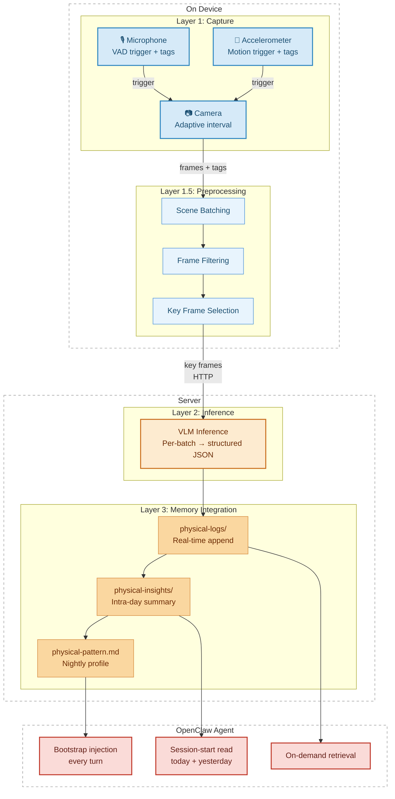

# 4. System Design

### 4.1 Pipeline Overview

The pipeline decomposes into four layers (Table 0) along two boundaries. *On-device layers* (Capture, Preprocessing) handle real-time sensor management and frame selection under mobile power constraints; *server-side layers* (Inference, Memory Integration) handle VLM calls and memory writes that require network access and persistent storage. Orthogonally, raw signal layers operate on pixels and sensor readings without understanding content; semantic layers convert visual input into structured text and route it into the agent's memory hierarchy.

\[**Table 0: Pipeline layers**\]

| **Bdy.1** - Platform | **Bdy.2 -** Processing type | Layer | Responsibility |
| --- | --- | --- | --- |
| On-device | Raw signal | Layer 1: Capture | Collect raw sensor data (camera, microphone, accelerometer) at adaptive intervals |
| On-device | Raw signal | Layer 1.5: Preprocessing | Cut frame stream into scene-level batches, filter low-quality frames, select key frames |
| Server-side | Semantic | Layer 2: Inference | Process each batch through a VLM to produce structured text descriptions |
| Server-side | Semantic | Layer 3: Memory Integration | Write descriptions into OpenClaw's memory at three levels of temporal granularity |

\[**Figure 1: Pipeline architecture**. Layer 1 captures frames at adaptive intervals triggered by audio and motion events; Layer 1.5 cuts scene batches, filters frames, and selects key frames; Layer 2 runs VLM inference per batch; Layer 3 writes to physical-logs, physical-insights, and physical-pattern.md.\]

The four layers are connected by two transfer mechanisms. The iOS device sends processed key-frame batches to the local server over HTTP; the server writes VLM outputs directly into OpenClaw's memory directory. This design keeps inference off-device—preserving battery and compute budget—while keeping memory writes local and human-readable. A browser-based web monitor on the server provides real-time visibility into batch output, three-tier memory state, and pipeline parameters; it is referenced throughout the following sections where relevant.

### 4.2 Layer1: Capture

The capture layer collects raw sensor data and controls when frames are captured. Three sensors participate—camera, microphone, accelerometer—each serving a dual role as both a trigger that modulates capture timing and a data source that attaches metadata to each frame.

**Sensor contributions.** Vision is the sole frame-producing sensor; audio and IMU contribute triggers and per-frame metadata. Egocentric vision captures environment, activity, and object interaction simultaneously within a single sensing channel (First-Person Vision (Kanade & Hebert, 2012)), making it the primary information source. Table 1 summarizes each sensor's dual role.

\[**Table 1: Sensor roles**\]

| Sensor | Trigger behavior | Data attached to each frame | Exclusions and rationale |
| --- | --- | --- | --- |
| Camera | — (responds to audio/IMU triggers) | RGB frame at adaptive interval | — |
| Microphone | VAD onset/offset → interval drops to minInterval | Speech activity tag; ambient noise level tag | Speaker identification excluded—diarization requires voice embeddings (biometric data), a privacy cost disproportionate to its personalization value |
| Accelerometer | Stationary ↔ sustained_motion transition → interval drops to minInterval | Binary motion state tag | Activity classification excluded—phone wearing posture makes accelerometer classifiers unreliable without per-user calibration |

A shared design principle underlies the exclusion column: fine-grained classification of social context (who is speaking) and physical activity (what the user is doing) is delegated to the VLM at inference time, where the visual frame provides richer and more reliable evidence than sensor signals alone. The capture layer's job is to detect *that* something changed, not to classify *what* changed.

**Adaptive capture strategy.** The pipeline captures discrete frames rather than continuous video. Continuous recording at a rate sufficient for video would generate far more data than the VLM can consume—most frames in a static scene are near-identical—while a fixed low rate risks missing brief events entirely. The adaptive interval architecture resolves this trade-off by coupling capture density to event detection. At rest, the camera captures at maxInterval—sufficient to detect slow scene changes without redundancy. When a sensor trigger fires (speech onset/offset, motion state change), the interval drops immediately to minInterval, ensuring dense coverage during activity transitions; it then ramps back toward maxInterval geometrically (governed by rampRatio) to avoid flooding the batch once the event ends. The camera becomes attentive precisely when something changes.

**Audio transcription.** On-device speech recognition (transcriptionEnabled) is configurable but disabled by default. When enabled, it produces a transcript for each speech segment, attached to frames captured during that segment. This flag is a study variable: transcription introduces richer linguistic content but adds on-device compute load and additional privacy considerations.

### 4.3 Layer1.5: Preprocessing

**Inference granularity.** The fundamental inference design question is whether the VLM processes frames individually or in scene-level batches. Per-frame inference is rejected on two grounds: adjacent frames are similar enough that per-frame descriptions are largely redundant—and API cost scales with frame count, making sustained deployment expensive—while per-frame calls preclude cross-frame reasoning about what changed between the start and end of a scene. The pipeline therefore adopts per-batch inference, treating each scene as the unit of analysis. The preprocessing layer's job is to produce those batches: segmenting the frame stream into scene-level units, filtering unusable frames, and selecting a compact set of representative key frames that maximize the signal the VLM receives per token spent.

**Batch boundary detection.** Batches are delimited by a two-stage process. Stage 1: a sensor trigger (VAD onset/offset or IMU state change) proposes a cut. Stage 2: SSIM-based visual similarity verification (Image Quality Assessment: From Error Visibility to Structural Similarity (Wang et al., 2004)) confirms or rejects—comparing the current frame against the last frame in the buffer to determine whether the scene has genuinely changed. If similarity remains high, the sensor event likely reflected a local fluctuation and capture continues. This two-stage design handles a fundamental ambiguity: sensor events do not reliably track scene changes, and visual similarity alone would rely entirely on time-based cutting. The combination allows sensor events to propose boundaries while visual content arbitrates. When no sensor trigger fires, time-based fallbacks force a cut after firstBatchWindowSeconds (first batch) or maxWindowSeconds (subsequent batches), ensuring the pipeline produces output even during long stable scenes.

**Frame selection.** Within each batch, low-quality frames (black, blurry) are firstly removed, and a composite importance score selects the final key frame set. The score weights four dimensions—visual sharpness, audio state, IMU state, and temporal sparsity—with a deliberate bias toward transitions: sensor onset/offset events score higher than sustained states, because transitions carry more information for a VLM reconstructing what happened in a scene. Trigger events from deleted frames are inherited by the next surviving frame, so that transition signals are not lost to quality filtering. Visually redundant frames are then removed by SSIM-based deduplication, and the target frame count scales with batch duration so that longer scenes receive proportionally more coverage. The dimension weights (wVisual, wAudio, wIMU, wSparsity) and deduplication threshold are experiment variables resolved during Phase 0.

### 4.4 Layer2: Inference

**VLM input construction.** Each inference call packages a batch into three components: a preamble, per-frame annotations, and the key frames themselves. For example, a batch covering 14:02–14:09 with 22 frames captured and 4 key frames selected would submit:

- **Preamble:** batch timestamp, duration (7 min), frame counts (22 captured / 4 selected).
- **Key frames:** the 4 selected images in chronological order.
- **Per-frame annotations:** each key frame labeled with its index, relative timestamp (e.g., +0:00, +1:32, +4:15, +6:48), and sensor tags at capture time (e.g., "stationary, speech active, moderate noise").
- **Prior batch context:** if a prior batch exists in the same session, its one-paragraph VLM summary (e.g., "The user was seated at a desk working on a laptop...") is included, giving the model continuity across consecutive scenes.

**Output format.** The VLM prompt is designed to elicit personalization-relevant descriptions rather than generic scene captions—it instructs the model to surface what an observation reveals about the user's habits, preferences, and routines, not merely what is visible. The model returns a structured JSON object with six fields: `activity`, `location`, `objects`, `social_context`, `notable_events`, and observation. The first five are concise extractions; the observation field is a short narrative paragraph in past tense and third person, suitable for direct insertion into the physical log. Fields with insufficient evidence are set to "not observed" rather than hallucinated. The prompt wording is an experiment variable iterated during Phase 0 and frozen at Phase 1 start.

### 4.5 Layer3: Memory Integration

**Three-tier direct write.** VLM outputs are written directly into OpenClaw's memory directory rather than passing through its native ingestion pipeline, which applies relevance heuristics designed for conversational memory (OpenClaw (Steinberger, 2025)). Physical-world observations require different retention logic—every batch output should be stored, not filtered by conversational relevance. The three tiers separate temporal granularity from retrieval cost:

\[**Table 2: Three-tier memory architecture**\]

| Tier | Content | Update mechanism | Visibility to agent |
| --- | --- | --- | --- |
| physical-logs/ | Full-volume batch outputs, appended in real time | Immediate append after each VLM inference | On-demand retrieval (indexed for search) |
| physical-insights/ | Rolling intra-day summary per date | Auto-triggered when batch count or time threshold is met; VLM merges new entries into existing summary | Session-start read (today + yesterday) |
| physical-pattern.md | Persistent behavioral profile | Nightly VLM update; merges day's insights into existing profile | Bootstrap injection (every agent turn) |

The visibility mapping reflects a trade-off between context budget and information recency. The pattern file earns constant injection by being compact and stable; insight files earn session-start loading by being bounded to two days; raw logs are too voluminous for routine injection but remain searchable on demand. This three-tier visibility follows OpenClaw's existing retrieval infrastructure (OpenClaw (Steinberger, 2025)).

The insight and pattern prompts share the same design principle as the log prompt—eliciting personalization-relevant distillation rather than generic summaries. Full prompt text for all three tiers is provided in Appendix A. Update thresholds `insight_min_batches`, `insight_min_minutes`) and nightly timing `nightly_hour`) are experiment variables calibrated during Phase 0.

*The full prompt text for all three tiers (log, insight, pattern) is provided in Appendix A.*

**Retention.** Physical logs and raw frames are retained for 14 days—long enough to capture weekly behavioral patterns while bounding storage and privacy exposure. Distilled outputs (insight files, pattern file) are retained indefinitely.

### 4.6 Implementation

The capture application is built for iOS using Swift, AVFoundation for camera and audio access, CoreMotion for accelerometer data, and Apple's Vision framework for frame similarity computation. The server is a Python Flask application that receives batches over HTTP, submits them to a vision-language model API—configurable as OpenRouter via the provider and model parameters—and writes outputs to the file system.

The hardware platform is an iPhone mounted at head level during waking hours, using a head strap that tracks the wearer's head orientation. This approximates the forward-facing perspective of dedicated smart glasses and preserves the implicit attention signal described in Chapter 3: what the wearer looks at recurrently appears in the field of view. The phone's field of view and stabilization are less consistent than a purpose-built device, but this variability reflects the kind of imperfect capture that any early-stage body-worn consumer device would produce in practice.
